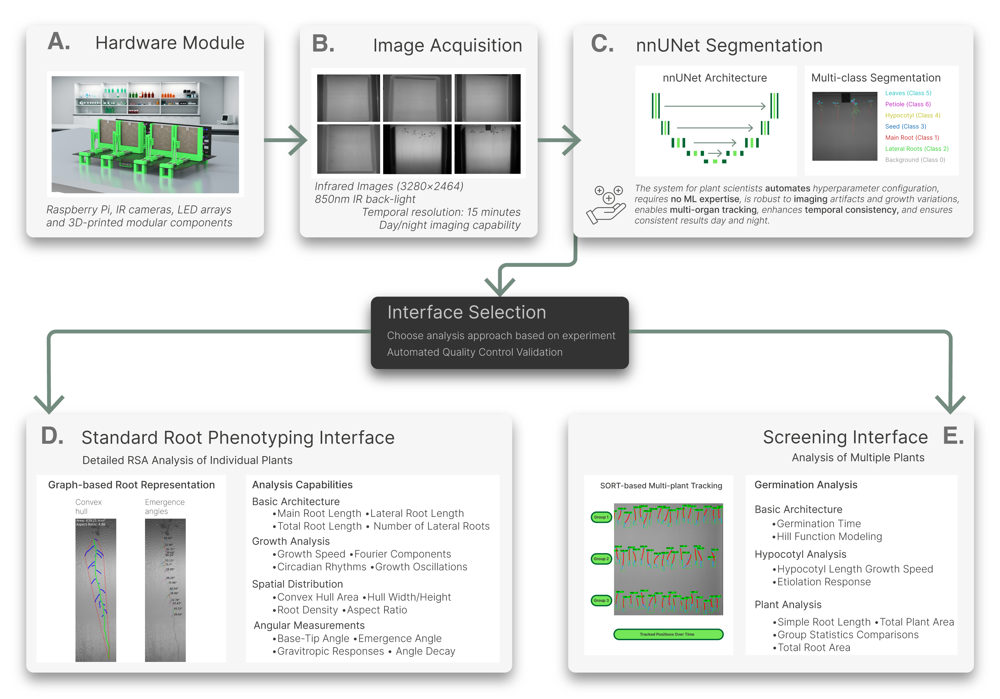
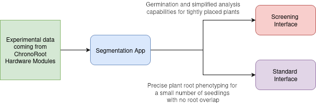
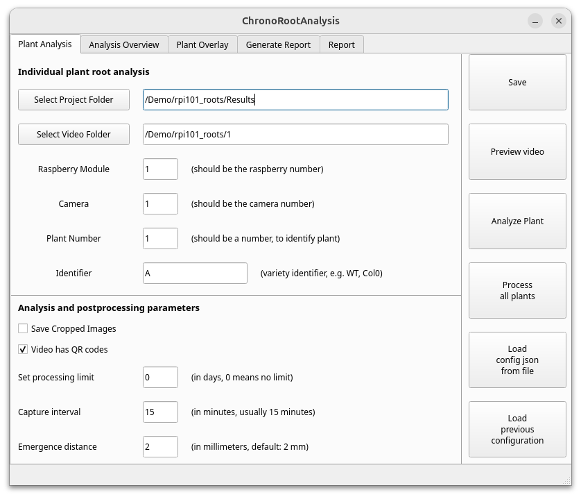
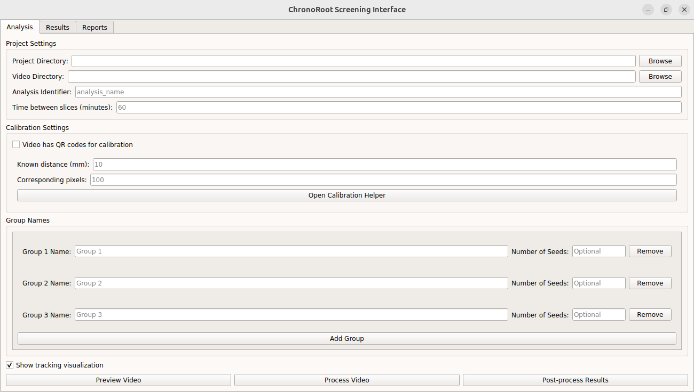

# ChronoRoot 2.0



[](http://arxiv.org/abs/2504.14736)
[](https://github.com/ngaggion/ChronoRoot2/blob/main/LICENSE)
[](https://hub.docker.com/r/ngaggion/chronoroot)

## An Open AI-Powered Platform for 2D Temporal Plant Phenotyping

ChronoRoot 2.0 is an integrated open-source platform that combines affordable hardware with advanced artificial intelligence to enable sophisticated temporal plant phenotyping. The system offers a comprehensive solution for analyzing plant development, featuring:

- **Multi-organ tracking** of six distinct plant structures (main root, lateral roots, seed, hypocotyl, leaves, and petiole)
- **Quality control** through real-time validation
- **Comprehensive measurements** including novel gravitropic response parameters
- **Dual specialized interfaces** for both detailed architectural analysis and high-throughput screening

ChronoRoot 2.0 is designed as a two-step phenotyping solution: first, the segmentation of plant structures using deep learning models, and second, the analysis of the segmented data through user-friendly interfaces. Depending on the research needs, users can choose between a detailed analysis of individual plants or a high-throughput screening of multiple plants.



## Workflow Overview

A typical ChronoRoot 2.0 workflow involves:

1. **Data Acquisition**: Collect temporal sequences of plant images using the ChronoRoot hardware setup. Images are captured at regular intervals (typically every 15 minutes) over several days.

2. **Segmentation**: Process raw images to identify plant structures using the nnUNet models. This step requires the usage of GPU and deep learning to automatically detect and segment different plant organs. Run it via the `segmentation` command.

3. **Analysis**: Analyze the segmented data with either:
   - **Standard Interface** (`chronoroot` command): For detailed analysis of individual plants with manual quality control
   - **Screening Interface** (`screening` command): For high-throughput automated analysis of multiple plants

4. **Report Generation**: Generate comprehensive reports with statistical analysis, visualizations, and comparisons between experimental groups.

## Demo Data

A demo dataset of plant imaging is available for testing. Located inside of both the `ngaggion/chronoroot:latest` Docker container or inside the apptainer container if desired, the data is pre-loaded at `/Demo/`. You can also download it manually from [Google Drive](https://drive.google.com/drive/folders/1PJCn_MMHcM9KPgz8dYe1F2Cvdt43FS3Z?usp=sharing).

Tutorials using the demo dataset are provided in PDF format within the `Documents/` folder of the repository and inside the Docker image at `/app/Documents/`.

## Repository Structure

```
ChronoRoot2
├── apptainerInstaller         # Apptainer/Singularity installation scripts
├── chronoRootApp              # Standard Root Phenotyping Interface
├── chronoRootScreeningApp     # High-throughput Screening Interface
├── Docker                     # Dockerfile for containerized deployment
├── Documents                  # User guides and technical documentation
├── segmentationApp            # AI-based segmentation tools (nnUNet)
├── environment.yml            # Conda environment specification
├── LICENSE                    # License information
├── README.md                  # This README file
└── logo_*.jpg                 # Logo images for executable applications
```

Each component has its own dedicated documentation:

- [Standard Root Phenotyping Interface](chronoRootApp/README.md) - For detailed analysis of individual plants
- [High-throughput Screening Interface](chronoRootScreeningApp/README.md) - For efficient analysis of multiple plants
- [Segmentation Module](segmentationApp/README.md) - AI-powered plant structure identification
- [Docker Guide](Docker/README.md) - Complete instructions for Docker-based deployment

PDF usage tutorials were incorporated in Documents for easy access. These make use of the Demo dataset included in the Docker image.

- [Standard Interface Tutorial](Documents/StandardInterfaceTutorial.pdf)
- [Screening Interface Tutorial](Documents/ScreeningTutorial.pdf)
- [Segmentation Tutorial](Documents/SegmentationTutorial.pdf)

## System Requirements

### Minimum Requirements
- **OS**: 
  - **Linux**: Ubuntu 20.04+ (Tested on Ubuntu 24.04)
  - **Windows**: Windows 10/11 (Requires WSL2)
  - **macOS**: **Not natively supported.** Must use Docker.
- **RAM**: 8 GB (16 GB recommended)
- **Disk Space**: ~15 GB for Singularity image, ~5 GB for application files
- **GPU**: Optional but recommended (NVIDIA with CUDA support for faster segmentation)
- **Display**: X11 server for GUI (included in Linux; Windows/WSL handles this automatically; macOS requires XQuartz)

### For GPU Acceleration
- NVIDIA GPU with CUDA 11.0+
- nvidia-docker2 (for Docker installations)
- GPU drivers properly installed

## Getting Started

### Installation Options

ChronoRoot 2.0 can be installed and used in three ways:

1. **Apptainer / Singularity (Recommended for Linux & Windows)**: A standalone installer that handles dependencies and creates Start Menu icons for easy launching.
2. **Docker Container (Required for macOS)**: Complete environment with all dependencies pre-configured for multi-platform support.
3. **Local Installation**: Manual Conda-based setup (Advanced users).

### Apptainer / Singularity Installation

We provide automated installers for Linux and Windows. These scripts will check for dependencies (Apptainer, Git LFS) and install them if missing.

#### Option A: Linux
Run the following in your terminal:
```bash
wget [https://raw.githubusercontent.com/ngaggion/ChronoRoot2/master/apptainerInstaller/installer_linux.sh](https://raw.githubusercontent.com/ngaggion/ChronoRoot2/master/apptainerInstaller/installer_linux.sh)
bash installer_linux.sh

```

#### Option B: Windows (via WSL)

**Prerequisite:** You must have WSL2 installed with a Linux distribution (e.g., Ubuntu).
Run the following **inside your WSL terminal**:

```bash
wget [https://raw.githubusercontent.com/ngaggion/ChronoRoot2/master/apptainerInstaller/installer_windows.sh](https://raw.githubusercontent.com/ngaggion/ChronoRoot2/master/apptainerInstaller/installer_windows.sh)
bash installer_windows.sh

```

*This will create shortcuts in your Windows Start Menu that launch the software transparently.*

See [apptainerInstaller/README.md](https://www.google.com/search?q=apptainerInstaller/README.md) for technical details.

### Docker Installation

Docker provides a consistent environment across all platforms. **This is the only supported method for macOS users.**

We recommend running the container with your current **User ID** to ensure that any data or results generated inside the container are owned by you (not the root user).

#### 1. Pull the Docker Image

```bash
docker pull ngaggion/chronoroot:latest

```

#### 2. Running on Linux

To enable the GUI and fix file permission issues, use the following command:

```bash
# Allow Docker to access your X server
xhost +local:docker

# Define your local data path
MOUNT="YOUR_LOCAL_DATA_PATH"

docker run -it --gpus all \
    -u $(id -u):$(id -g) \
    -v /etc/passwd:/etc/passwd:ro \
    -v /etc/group:/etc/group:ro \
    -v $MOUNT:/DATA/ \
    -e DISPLAY=$DISPLAY \
    -v /tmp/.X11-unix:/tmp/.X11-unix \
    --shm-size=8gb \
    ngaggion/chronoroot:latest

# Restrict X server access when finished
xhost -local:docker

```

#### 3. Running on Windows (WSL2)

Use the command below to ensure proper display and user permissions in WSL2:

```bash
MOUNT="/mnt/c/path/to/your/data"

docker run -it --gpus all \
    -u $(id -u):$(id -g) \
    -v /etc/passwd:/etc/passwd:ro \
    -v /etc/group:/etc/group:ro \
    -v $MOUNT:/DATA/ \
    -v /tmp/.X11-unix:/tmp/.X11-unix \
    -v /mnt/wslg:/mnt/wslg \
    -e DISPLAY \
    -e WAYLAND_DISPLAY \
    -e XDG_RUNTIME_DIR \
    -e PULSE_SERVER \
    --shm-size=8gb \
    ngaggion/chronoroot:latest

```

> **Note**: If you don't have a GPU, remove the `--gpus all` flag from the command above. For GPU support, you need to install nvidia-docker2.

#### Convenient Aliases (Docker)

These are pre-configured in the container. When running with the user flag (`-u`) as shown above, you can simply use these commands to launch the interfaces:

```bash
segmentation   # Launch AI-based segmentation tools
chronoroot     # Launch Standard Phenotyping Interface
screening      # Launch High-throughput Screening Interface

```

### Local Installation

**Platform Compatibility**: Local installation has been thoroughly tested on Ubuntu. **For Windows and macOS, we strongly recommend using the Docker or Apptainer methods** to avoid complex dependency issues.

#### Manual Conda Installation

Run:

```bash
conda env create -f environment.yml

```

Or if you prefer to install manually or need to customize the installation (for example you don't need nnUNet), use the following:

```bash
conda create -y -n ChronoRoot python=3.13.9 \
    networkx=3.5 \
    pyqt=5.15.11 \
    numpy=2.2 \
    scikit-image=0.25.2 \
    pandas=2.3.3 \
    seaborn=0.13.2 \
    filterpy=1.4.5 \
    lifelines=0.30.0 \
    scikit-fda=0.10.1 \
    scipy=1.16.3 \
    pyzbar=0.1.9 \
    -c conda-forge

conda activate ChronoRoot
pip install opencv-python lapx==0.9.2 nnunetv2==2.6.2

```
## Hardware and Module Controller

ChronoRoot 2.0 is designed to work with an affordable custom hardware setup that includes:

- Raspberry Pi 3B computer
- Fixed-zoom cameras (RaspiCam v2)
- Infrared LED backlighting
- 3D-printed and laser-cut components

For detailed hardware specifications and assembly instructions, see the [ChronoRootModuleHardware repository](https://github.com/ThomasBlein/ChronoRootModuleHardware).

For the controller software for the Raspberry Pi 3B, see the [ChronoRoot Module Controller repository](https://github.com/ThomasBlein/ChronoRootControl).

## Usage

### Standard Root Phenotyping Interface

For detailed architectural analysis of individual plants:

**With Docker aliases:**
```bash
chronoroot
```

**Manual activation (local installation):**
```bash
conda activate ChronoRoot
cd chronoRootApp
python run.py
```



For more details on using this interface, see the [Standard Interface documentation](chronoRootApp/README.md).

### Screening Interface

For high-throughput analysis of multiple plants:

**With Docker aliases:**
```bash
screening
```

**Manual activation (local installation):**
```bash
conda activate ChronoRoot
cd chronoRootScreeningApp
python run.py
```



For more details on using this interface, see the [Screening Interface documentation](chronoRootScreeningApp/README.md).

### Segmentation

To run the AI-powered segmentation pipeline:

**With Docker aliases:**
```bash
segmentation
```

**Manual activation (local installation):**
```bash
conda activate ChronoRoot
cd segmentationApp
python run.py
```


For detailed instructions on the segmentation process, see the [Segmentation documentation](segmentationApp/README.md).

## Citation

If you use ChronoRoot 2.0 in your research, please cite our paper:

```bibtex
@article{gaggion2025chronoroot,
  title={ChronoRoot 2.0: An Open AI-Powered Platform for 2D Temporal Plant Phenotyping},
  author={Gaggion, Nicolás and Bonazzola, Rodrigo and Legascue, María Florencia and Mammarella, María Florencia and Rodriguez, Florencia Sol and Aballay, Federico Emanuel and Catulo, Florencia Belén and Barrios, Andana and Accavallo, Franco and Villarreal, Santiago Nahuel and Crespi, Martin and Ricardi, Martiniano María and Petrillo, Ezequiel and Blein, Thomas and Ariel, Federico and Ferrante, Enzo},
  journal={arXiv preprint arXiv:2504.14736},
  year={2025}
}
```
## License

ChronoRoot 2.0 is released under the [GNU General Public License v3.0](LICENSE).

## Contact

For questions or support, please [open an issue](https://github.com/ngaggion/ChronoRoot2/issues) on GitHub.
