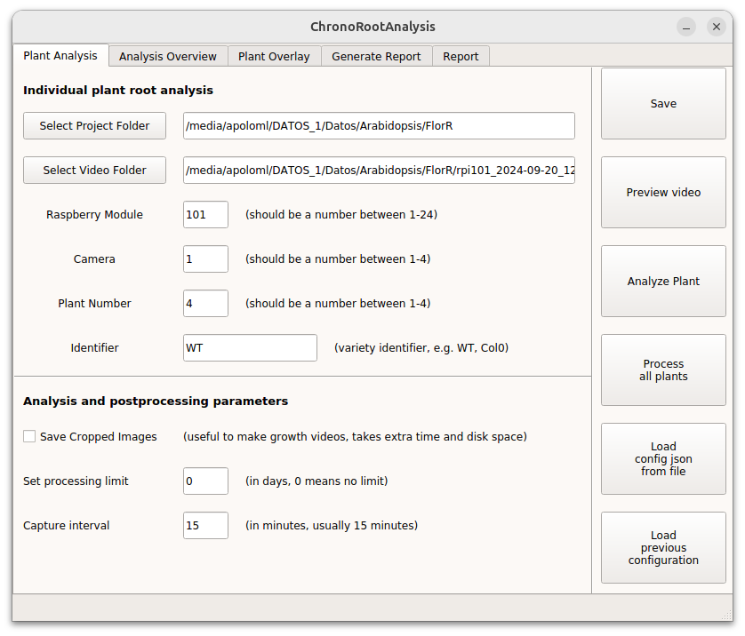

# ChronoRoot 2.0


[](http://arxiv.org/abs/2504.14736)
[](https://github.com/ngaggion/ChronoRoot2/blob/main/LICENSE)
[](https://hub.docker.com/r/ngaggion/chronoroot)

## An Open AI-Powered Platform for 2D Temporal Plant Phenotyping

ChronoRoot 2.0 is an integrated open-source platform that combines affordable hardware with advanced artificial intelligence to enable sophisticated temporal plant phenotyping. The system offers a comprehensive solution for analyzing plant development, featuring:

- **Multi-organ tracking** of six distinct plant structures (main root, lateral roots, seed, hypocotyl, leaves, and petiole)
- **Quality control** through real-time validation
- **Comprehensive measurements** including novel gravitropic response parameters
- **Dual specialized interfaces** for both detailed architectural analysis and high-throughput screening

ChronoRoot 2.0 is designed as a two-step phenotyping solution: first, the segmentation of plant structures using deep learning models, and second, the analysis of the segmented data through user-friendly interfaces. Depending on the research needs, users can choose between a detailed analysis of individual plants or a high-throughput screening of multiple plants.


## Repository Structure

```
ChronoRoot2
├── chronoRootApp              # Standard Root Phenotyping Interface
├── chronoRootScreeningApp     # High-throughput Screening Interface
├── segmentationApp            # AI-based segmentation tools (nnUNet)
├── environment.yml            # Conda environment specification
├── install.sh                 # Automated installation script
├── Docker                     # Dockerfile for containerized deployment
└── Documents                  # User guides and technical documentation
```

Each component has its own dedicated documentation:

- [Standard Root Phenotyping Interface](chronoRootApp/README.md) - For detailed analysis of individual plants
- [High-throughput Screening Interface](chronoRootScreeningApp/README.md) - For efficient analysis of multiple plants
- [Segmentation Module](segmentationApp/README.md) - AI-powered plant structure identification
- [Docker Guide](Docker/README.md) - Complete instructions for Docker-based deployment

PDF usage tutorials were incorporated in Documents for easy access. These make use of the Demo dataset included in the Docker image.

- [Standard Interface Tutorial](Documents/StandardInterfaceTutorial.pdf)
- [Screening Interface Tutorial](Documents/ScreeningTutorial.pdf)
- [Segmentation Tutorial](Documents/SegmentationTutorial.pdf)

## Getting Started

### Installation Options

ChronoRoot 2.0 can be installed and used in three ways:

1. **Docker Container (Recommended)**: Complete environment with all dependencies pre-configured
2. **Local Installation**: Quick conda-based setup for Ubuntu/macOS systems
3. **Singularity Container**: Alternative for HPC environments without Docker access


## Docker Installation (Recommended)

Docker provides the most reliable installation method across all platforms, ensuring an identical environment regardless of your operating system.

### Pull the Docker Image

```bash
docker pull ngaggion/chronoroot:latest
```

### Running on Linux

For Linux systems, enable X11 forwarding for the graphical user interface:

```bash
xhost +local:docker
```

Run the container:

```bash
MOUNT="YOUR_LOCAL_DATA_PATH"

docker run -it --gpus all \
    -v $MOUNT:/DATA/ \
    -e DISPLAY=$DISPLAY \
    -v /tmp/.X11-unix:/tmp/.X11-unix \
    --shm-size=8gb \
    ngaggion/chronoroot:latest
```

After use, restrict X server access:

```bash
xhost -local:docker
```

### Running on Windows (WSL2)

ChronoRoot has been tested under Windows Subsystem for Linux, version 2. Please refer to [this link](https://learn.microsoft.com/en-us/windows/wsl/tutorials/wsl-containers) for information on how to set up Docker with WSL2.

Use the command below for WSL2:

```bash
MOUNT="YOUR_LOCAL_DATA_PATH"

docker run -it --gpus all \
    -v $MOUNT:/DATA/ \
    -v /tmp/.X11-unix:/tmp/.X11-unix \
    -v /mnt/wslg:/mnt/wslg \
    -e DISPLAY \
    -e WAYLAND_DISPLAY \
    -e XDG_RUNTIME_DIR \
    -e PULSE_SERVER \
    --shm-size=8gb \
    ngaggion/chronoroot:latest
```

> **Note**: If you don't have a GPU, remove the `--gpus all` flag from the command above. For GPU support, you need to install nvidia-docker2. See the [Docker documentation](Docker/README.md) for detailed instructions.


### Convenient Aliases (Docker)

To simplify usage, these aliases are pre-configured in the Docker container:

```bash
alias segmentation='conda activate ChronoRoot; cd /app/segmentationApp; python run.py'
alias chronoroot='conda activate ChronoRoot; cd /app/chronoRootApp; python run.py'
alias screening='conda activate ChronoRoot; cd /app/chronoRootScreeningApp; python run.py'
```

With these aliases, you can simply use `segmentation`, `chronoroot`, or `screening` commands instead of the full activation and navigation commands.

## Local Installation

**Platform Compatibility**: Local installation has been thoroughly tested on Ubuntu. **For other systems, we strongly recommend using Docker** to avoid potential compatibility issues.

### Quick Installation (Ubuntu)

Clone the repository and run the automated installer:

```bash
git clone https://github.com/ngaggion/ChronoRoot2.git
cd ChronoRoot2
bash install.sh
conda activate ChronoRoot
```

The installer will:
1. Install required system dependencies (zbar library)
2. Create a conda environment with all necessary packages
3. Install Python dependencies via pip

### Manual Conda Installation

If you prefer to install manually or need to customize the installation:

```bash
conda create -y -n ChronoRoot python=3.13.9 \
    networkx=3.5 \
    pyqt=5.15.11 \
    numpy=2.2 \
    scikit-image=0.25.2 \
    pandas=2.3.3 \
    seaborn=0.13.2 \
    filterpy=1.4.5 \
    lifelines=0.30.0 \
    scikit-fda=0.10.1 \
    scipy=1.16.3 \
    pyzbar=0.1.9 \
    -c conda-forge

conda activate ChronoRoot
pip install opencv-python lapx==0.9.2 nnunetv2==2.6.2
```

> **Note**: This single environment handles all functionality including segmentation, analysis, and FPCA. No separate environments are needed.

## Singularity Installation

For high-performance computing environments where Docker is not available:

```bash
singularity build ChronoRoot.simg docker://ngaggion/chronoroot
```

This creates a Singularity container from the Docker image, providing the same functionality in HPC environments.

## Hardware and Module Controller

ChronoRoot 2.0 is designed to work with an affordable custom hardware setup that includes:

- Raspberry Pi 3B computer
- Fixed-zoom cameras (RaspiCam v2)
- Infrared LED backlighting
- 3D-printed and laser-cut components

For detailed hardware specifications and assembly instructions, see the [ChronoRootModuleHardware repository](https://github.com/ThomasBlein/ChronoRootModuleHardware).

For the controller software for the Raspberry Pi 3B, see the [ChronoRoot Module Controller repository](https://github.com/ThomasBlein/ChronoRootControl).


## Usage

### Standard Root Phenotyping Interface

For detailed architectural analysis of individual plants:

**With Docker aliases:**
```bash
chronoroot
```

**Manual activation (local installation):**
```bash
conda activate ChronoRoot
cd chronoRootApp
python run.py
```



For more details on using this interface, see the [Standard Interface documentation](chronoRootApp/README.md).

### Screening Interface

For high-throughput analysis of multiple plants:

**With Docker aliases:**
```bash
screening
```

**Manual activation (local installation):**
```bash
conda activate ChronoRoot
cd chronoRootScreeningApp
python run.py
```


For more details on using this interface, see the [Screening Interface documentation](chronoRootScreeningApp/README.md).

### Segmentation

To run the AI-powered segmentation pipeline:

**With Docker aliases:**
```bash
segmentation
```

**Manual activation (local installation):**
```bash
conda activate ChronoRoot
cd segmentationApp
python run.py
```


For detailed instructions on the segmentation process, see the [Segmentation documentation](segmentationApp/README.md).

## Workflow Overview

A typical ChronoRoot 2.0 workflow involves:

1. **Data Acquisition**: Collect temporal sequences of plant images using the ChronoRoot hardware setup. Images are captured at regular intervals (typically every 15 minutes) over several days.

2. **Segmentation**: Process raw images to identify plant structures using the nnUNet models. This step uses deep learning to automatically detect and segment different plant organs.

3. **Analysis**: Analyze the segmented data with either:
   - **Standard Interface** (`chronoroot` command): For detailed analysis of individual plants with manual quality control
   - **Screening Interface** (`screening` command): For high-throughput automated analysis of multiple plants

4. **Report Generation**: Generate comprehensive reports with statistical analysis, visualizations, and comparisons between experimental groups.

## Citation

If you use ChronoRoot 2.0 in your research, please cite our paper:

```bibtex
@article{gaggion2025chronoroot,
  title={ChronoRoot 2.0: An Open AI-Powered Platform for 2D Temporal Plant Phenotyping},
  author={Gaggion, Nicolás and Bonazzola, Rodrigo and Legascue, María Florencia and Mammarella, María Florencia and Rodriguez, Florencia Sol and Aballay, Federico Emanuel and Catulo, Florencia Belén and Barrios, Andana and Accavallo, Franco and Villarreal, Santiago Nahuel and Crespi, Martin and Ricardi, Martiniano María and Petrillo, Ezequiel and Blein, Thomas and Ariel, Federico and Ferrante, Enzo},
  journal={arXiv preprint arXiv:2504.14736},
  year={2025}
}
```

## License

ChronoRoot 2.0 is released under the [GNU General Public License v3.0](LICENSE).

## Contact

For questions or support, please [open an issue](https://github.com/ngaggion/ChronoRoot2/issues) on GitHub.