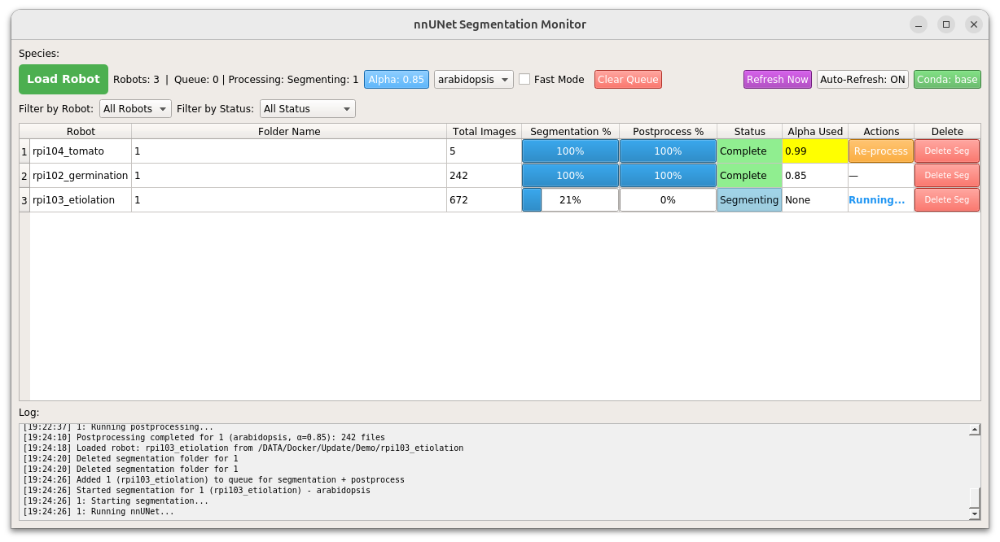

# ChronoRoot 2.0


[](http://arxiv.org/abs/2504.14736)
[](https://github.com/ngaggion/ChronoRoot2/blob/main/LICENSE)
[](https://hub.docker.com/r/ngaggion/chronoroot)

## An Open AI-Powered Platform for 2D Temporal Plant Phenotyping

ChronoRoot 2.0 is an integrated open-source platform that combines affordable hardware with advanced artificial intelligence to enable sophisticated temporal plant phenotyping. The system offers a comprehensive solution for analyzing plant development, featuring:

- **Multi-organ tracking** of six distinct plant structures (main root, lateral roots, seed, hypocotyl, leaves, and petiole)
- **Quality control** through real-time validation
- **Comprehensive measurements** including novel gravitropic response parameters
- **Dual specialized interfaces** for both detailed architectural analysis and high-throughput screening

## Repository Structure

```
ChronoRoot2
├── chronoRootApp              # Standard Root Phenotyping Interface
├── chronoRootScreeningApp     # High-throughput Screening Interface
├── segmentationApp            # AI-based segmentation tools (nnUNet)
├── Docker                     # Dockerfile for containerized deployment
└── Documentation              # User guides and technical documentation
```

Each component has its own dedicated documentation:

- [Standard Root Phenotyping Interface](chronoRootApp/README.md) - For detailed analysis of individual plants
- [High-throughput Screening Interface](chronoRootScreeningApp/README.md) - For efficient analysis of multiple plants
- [Segmentation Module](segmentationApp/README.md) - AI-powered plant structure identification
- [Docker Guide](Docker/README.md) - Complete instructions for Docker-based deployment

## Getting Started

### Installation Options

ChronoRoot 2.0 can be installed and used in three ways:

1. **Docker Container (Recommended)**: Complete environment with all dependencies
2. **Local Installation**: Separate installation of interfaces and segmentation tools
3. **Singularity Container**: Alternative for environments without sudo access

### Docker Installation (Recommended)

Pull the Docker image from Docker Hub:

```bash
docker pull ngaggion/chronoroot:latest
```

For Linux, enable X11 forwarding for the user interface:

```bash
xhost +local:docker
```

Run the container:

```bash
MOUNT="YOUR_LOCAL_DATA_PATH"

docker run -it --gpus all \
    -v $MOUNT:/DATA/ \
    -e DISPLAY=$DISPLAY \
    -v /tmp/.X11-unix:/tmp/.X11-unix \
    --shm-size=8gb \
    ngaggion/chronoroot:latest
```

After use, restrict X server access:

```bash
xhost -local:docker
```

For Windows, ChronoRoot has been tested under Windows Subsystem for Linux, version 2. Please refer to [this link](https://learn.microsoft.com/en-us/windows/wsl/tutorials/wsl-containers) for information on how to set up Docker.
Please, use the command below instead.

```bash
MOUNT="YOUR_LOCAL_DATA_PATH"

docker run -it --gpus all \
    -v $MOUNT:/DATA/ \
    -v /tmp/.X11-unix:/tmp/.X11-unix \
    -v /mnt/wslg:/mnt/wslg \
    -e DISPLAY \
    -e WAYLAND_DISPLAY \
    -e XDG_RUNTIME_DIR \
    -e PULSE_SERVER \
    --shm-size=8gb \
    ngaggion/chronoroot:latest
```

> **Note**: For GPU support, you need to install nvidia-docker2. See the [Docker documentation](Docker/README.md) for detailed instructions.

#### Convenient Aliases (Docker)

To simplify usage, these aliases were added to the Docker container's bashrc:

``` bash
alias segmentation='source activate ChronoRootInterface; cd /app/segmentationApp; python run.py'
alias chronoroot='source activate ChronoRootInterface; cd /app/chronoRootApp; python run.py'
alias screening='source activate ChronoRootInterface; cd /app/chronoRootScreeningApp; python run.py'
```

With these aliases, you can simply use `segmentation`, `chronoroot`, or `screening` commands instead of the full activation and navigation commands.

### Local Installation

#### 1. Interface Installation

```bash
conda create -y -n ChronoRootInterface python=3.8
conda activate ChronoRootInterface
conda install -c "conda-forge/label/cf202003" graph-tool=2.29 pyqt=5.9.2
conda install numpy scikit-image pandas seaborn
conda install -c conda-forge pyzbar
pip install opencv-python filterpy lifelines
```

For Functional PCA analysis:

```bash
conda create -n FDA
conda activate FDA
conda install -c conda-forge scikit-fda scipy pandas matplotlib seaborn ipykernel
```

#### 2. nnUNet Installation

Follow the instructions in our [modified nnUNet repository](https://github.com/ngaggion/nnUNet) designed specifically for ChronoRoot 2.0.

### Singularity Installation

For environments without sudo access:

```bash
singularity build ChronoRoot.simg docker://ngaggion/chronoroot
```

## Hardware and Module Controller

ChronoRoot 2.0 is designed to work with an affordable custom hardware setup that includes:

- Raspberry Pi 3B computer
- Fixed-zoom cameras (RaspiCam v2)
- Infrared LED backlighting
- 3D-printed and laser-cut components

For detailed hardware specifications and assembly instructions, see the [ChronoRootModuleHardware repository](https://github.com/ThomasBlein/ChronoRootModuleHardware).

For the controller of the Raspberry Pi 3B, see the [ChronoRoot Module Controller repository](https://github.com/ThomasBlein/ChronoRootControl).

## Usage

### Standard Root Phenotyping Interface

For detailed architectural analysis of individual plants:

**With aliases (Docker):**
```bash
chronoroot
```

**Manual activation:**
```bash
conda activate ChronoRootInterface
cd chronoRootApp
python run.py
```


For more details on using this interface, see the [Standard Interface documentation](chronoRootApp/README.md).

### Screening Interface

For high-throughput analysis of multiple plants:

**With aliases (Docker):**
```bash
screening
```

**Manual activation:**
```bash
conda activate ChronoRootInterface
cd chronoRootScreeningApp
python run.py
```


For more details on using this interface, see the [Screening Interface documentation](chronoRootScreeningApp/README.md).

### Segmentation

To run the segmentation pipeline:

**With aliases (Docker):**
```bash
segmentation
```

**Manual activation:**
```bash
conda activate ChronoRootInterface
cd segmentationApp
python run.py
```



For detailed instructions on the segmentation process, see the [Segmentation documentation](segmentationApp/README.md).

## Workflow Overview

A typical ChronoRoot 2.0 workflow involves:

1. **Data Acquisition**: Collect temporal sequences of plant images using the hardware setup
2. **Segmentation**: Process raw images to identify plant structures using the nnUNet models (`segmentation` command)
3. **Analysis**: Analyze the segmented data with either the Standard (`chronoroot` command) or Screening (`screening` command) interface
4. **Report Generation**: Generate comprehensive reports with statistical analysis and visualizations

## Citation

If you use ChronoRoot 2.0 in your research, please cite our paper:

```bibtex
@article{gaggion2025chronoroot,
  title={ChronoRoot 2.0: An Open AI-Powered Platform for 2D Temporal Plant Phenotyping},
  author={Gaggion, Nicolás and Bonazzola, Rodrigo and Legascue, María Florencia and Mammarella, María Florencia and Rodriguez, Florencia Sol and Aballay, Federico Emanuel and Catulo, Florencia Belén and Barrios, Andana and Accavallo, Franco and Villarreal, Santiago Nahuel and Crespi, Martin and Ricardi, Martiniano María and Petrillo, Ezequiel and Blein, Thomas and Ariel, Federico and Ferrante, Enzo},
  journal={arXiv preprint arXiv:2504.14736},
  year={2025}
}
```

## License

ChronoRoot 2.0 is released under the [GNU General Public License v3.0](LICENSE).

## Contact

For questions or support, please [open an issue](https://github.com/ngaggion/ChronoRoot2/issues) on GitHub.
