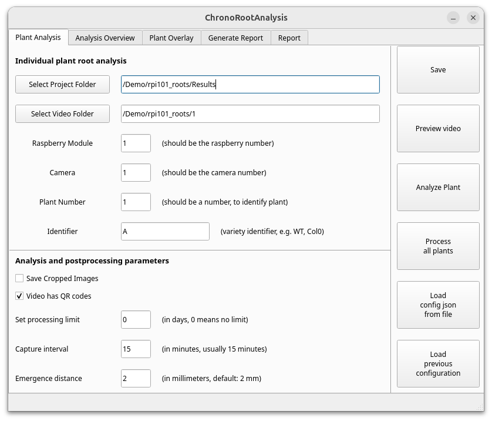

# ChronoRoot 2.0 - Standard Root Phenotyping Interface

This directory contains the Standard Root Phenotyping Interface for ChronoRoot 2.0, designed for detailed architectural analysis of individual plant root systems.



## Overview

The Standard Interface maintains continuity with the original ChronoRoot system while adding modern visualization capabilities and enhanced analysis methods. It provides tools for precise measurement of root system architecture (RSA) parameters and growth patterns through a graph-based representation approach.

## Key Features

- Detailed RSA analysis through graph-based representation
- Temporal tracking of root development
- Real-time visualization of segmentation results
- Comprehensive statistical analysis of growth patterns
- Automated report generation
- Export in Root System Markup Language (RSML) format

## Directory Structure

```
chronoRootApp/
├── analysis/                  # Core analysis modules
│   ├── graphUtils/            # Graph representation utilities
│   ├── imageUtils/            # Image processing utilities
│   ├── rsmlUtils/             # RSML export functionality
│   └── utils/                 # General utility functions (incl. report_paths.py)
├── placeholder_figures/       # Default images for the interface
├── Screenshots/               # Interface screenshots for documentation
├── 1_analysis.py              # Plant selection and analysis workflow
├── 2_postprocess.py           # Post-processing of analysis results
├── 3_generateReport.py        # Report generation functionality
├── plant_viewer.py            # Quality control and review tools
├── 5_rerun_all_analysis.py    # Batch reprocessing utility
├── calibration_helper.py      # Calibration tool implementation
├── default.json               # Default parameters
└── run.py                     # Main interface implementation
```

### Analysis output (per plant)

Per-plant tracking results are stored under:

```
{Project}/Analysis/{Experiment}/{rpi}/cam_{N}/plant_{N}/Results_{j}/
```

The GUI shows one row per plant slot and always uses the latest `Results_*` folder. Older runs are removed automatically after a successful repeat/redo analysis.

### Report output (metric-first)

Generated reports are organized by biological metric under `{Project}/Report/`. Each comparison mode produces a paired plot and stats file (`{metric_slug}_{mode}.png` + `{metric_slug}_{mode}_stats.txt`). The Report tab in the GUI lists all PNG figures by scanning the folder tree on disk.

```
Report/
├── data/                              # Aggregated CSV inputs
├── individual_plots/{experiment}/     # Per-plant growth curves
├── temporal_parameters/
│   ├── overview/                      # Cross-metric summary (all_metrics_subplots.png, summary_by_*.csv)
│   ├── main_root_length/
│   │   ├── main_root_length_by_genotype.png
│   │   ├── main_root_length_by_genotype_stats.txt
│   │   ├── summary_table.csv
│   │   ├── fpca/pc1/                  # FPCA nested under parent metric
│   │   └── growth_speed/              # Fourier growth speed (MR/TR)
│   └── ...
├── convex_hull/{metric_slug}/
├── angles/
│   ├── mean_emergence_angle/
│   ├── first_lr_tip_angle/
│   └── overlays_{experiment}/         # Angle overlay images
```

Stats file headers state exactly how values are averaged (per-plant mean per interval vs all hourly observations), driven by the **Average intervals before testing** option in the stats configuration dialog.

On the **Generate Report** tab, three optional axis-label fields (to the right of Processing limit) control how genotypes, plate conditions, and extra variables are named on figures and in stats headers. The same genotype always receives the same color across all report modules (`tab10` for genotypes, `Set2` for plate conditions, `husl` for extra variables).

FPCA writes a fixed **3×2 overview panel** per metric at `temporal_parameters/{metric}/fpca/{metric}_overview.png` (temporal curve, PC scatter, boxplots, and interpretation curves). Per-PC comparison plots and stats live under `fpca/pc{n}/`.

## Measurements Provided

The Standard Interface provides the following measurements:

### Basic Architecture
- Main Root (MR) Length
- Lateral Root (LR) Length
- Total Root (TR) Length
- Number of Lateral Roots
- Discrete LR Density
- Main Over Total Root ratio

### Growth Analysis
- Growth Speed
- Fourier Components

### Spatial Distribution
- Convex Hull Area
- Convex Hull Width
- Convex Hull Height
- Root Density
- Aspect Ratio

### Angular Measurements
- Base-Tip Angle
- Emergence Angle

## Usage

### Starting the Interface

```bash
conda activate ChronoRootInterface
python run.py
```

## Integration with Segmentation

This interface works with segmentation masks produced by the nnUNet module in `segmentationApp/`. For best results, ensure that videos are properly segmented before analysis.