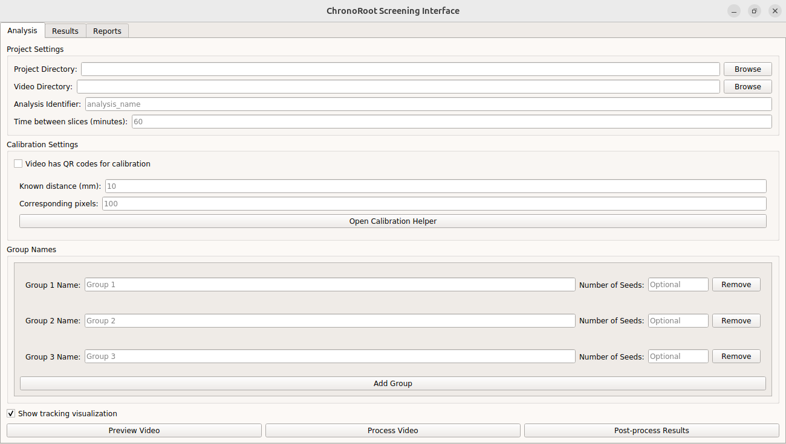

# ChronoRoot 2.0 - Screening Interface

This directory contains the High-throughput Screening Interface for ChronoRoot 2.0, designed for efficient analysis of multiple plants simultaneously.



## Overview

The Screening Interface extends ChronoRoot 2.0's capabilities to high-throughput scenarios through automated multi-plant tracking. It enables researchers to efficiently process and compare multiple experimental conditions, with specialized modules for germination analysis, hypocotyl development, and basic plant measurements.

## Key Features

- Automated tracking of multiple plants using SORT algorithm
- Experimental group definition for comparative studies
- Robust calibration tools for standardized measurements
- Quality control mechanisms for data reliability
- Specialized analysis modules for different aspects of plant development
- Comprehensive statistical comparison between experimental groups

## Directory Structure

```
chronoRootScreeningApp/
├── data_processing/           # Specialized analysis modules
│   ├── fourier.py             # Fourier analysis of growth patterns
│   ├── fpca.py                # Functional PCA implementation
│   ├── germination_analysis.py # Germination timing analysis
│   └── plant_analysis.py      # Basic plant measurements
├── screenshots/               # Interface screenshots for documentation
├── calibration_helper.py      # Calibration tool implementation
├── postprocess_results.py     # Post-processing utilities
├── preview_video.py           # Video preview functionality
├── process_video.py           # Main processing pipeline
├── qr.py                      # QR code detection for automatic calibration
├── run.py                     # Entry point script
└── sort.py                    # Simple Online Realtime Tracking implementation
```

## Usage

### Starting the Interface

```bash
conda activate ChronoRootInterface
python run.py
```

### Group Definition

The interface supports manual definition of experimental groups through an interactive region selection tool. Groups can represent different:

- Genotypes
- Treatments
- Combinations of factors

Note that if there are two sets of plants for the same group but are not available to be selected within one rectangular bounding box, the group needs to be added twice.